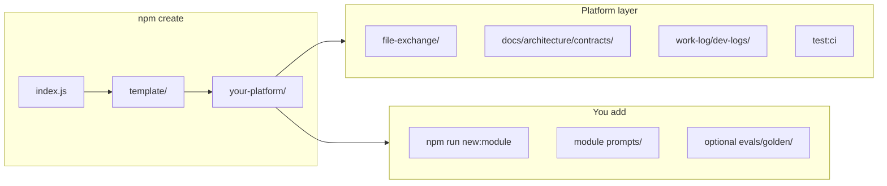

# @pukujan/create-modular-monolith

**Scaffold a modular monolith built for human + Cursor agent engineering** — Express + React, versioned contracts, file-exchange handoffs, paired dev logs, and CI gates out of the box.

```bash
npm create @pukujan/modular-monolith@2.2.1 my-platform
cd my-platform
npm install --prefix backend && npm install --prefix frontend
npm run test:ci
```

[](package.json)
[](LICENSE)

| | |
|---|---|
| **This package** | `npm create` boilerplate — architecture only (`_reference`, `model-condenser`) |
| **Full product example** | [litigation-prompt-engineering](https://github.com/Pukujan/litigation-prompt-engineering) — domain modules, prompts, evals |

---

## What this is

`@pukujan/create-modular-monolith` copies the `template/` folder into your chosen directory. You get a **platform**, not a hello-world demo:

- **Modular monolith** — feature modules with enforced boundaries and internal MVC layers
- **Architecture contracts** — versioned manifest so paths and tooling stay in sync
- **File exchange** — dated `imports/` / `exports/` for human↔agent file handoff
- **Pre-push dev logs** — human markdown (summary + detail) + agent JSON audit before every push
- **CI gates** — `npm run test:ci` matches GitHub Actions (lint, tests, module evals)
- **Cursor-native** — `AGENTS.md`, `.cursor/rules`, `.cursor/commands`

Domain logic is **yours**: `npm run new:module -- billing --label "Billing"`.

---

## Why use this

| Problem | How the template helps |
|---------|-------------------------|
| Agents read random folders | Mandatory `file-exchange/imports/{stamp}/` + [AGENTS.md](template/AGENTS.md) |
| Undocumented APIs | [docs/API.md](template/docs/API.md) registry + `lint:api-docs` |
| Lost context between sessions | Paired dev logs under `work-log/dev-logs/` |
| Repo layout drift | `lint:contracts` + [CONTRACTS_OVERVIEW](template/docs/architecture/CONTRACTS_OVERVIEW.md) |
| No merge-quality bar | `.github/workflows/ci.yml` + `npm run test:ci` |

---

## How it works



After scaffold, read [template/docs/architecture/PLATFORM_ARCHITECTURE.md](template/docs/architecture/PLATFORM_ARCHITECTURE.md) and [template/docs/architecture/EVAL_AND_CI.md](template/docs/architecture/EVAL_AND_CI.md).

---

## Quick start (after scaffold)

```bash
cd my-platform

cp backend/.env.example backend/.env
cp frontend/.env.example frontend/.env

cd backend && npm run dev
# new terminal:
cd frontend && npm run dev
```

**Quality gate (run before push):**

```bash
npm run test:ci
npm run dev-log:pre-push -- --slug initial-setup
```

---

## What ships in `template/`

| Area | Contents |
|------|----------|
| Backend | `backend/src/core/`, `modules/_reference`, `modules/model-condenser` |
| Frontend | `frontend/src/core/`, `modules/_reference` |
| Docs | `docs/architecture/` — guardrails, contracts, PLATFORM_ARCHITECTURE, EVAL_AND_CI |
| Exchange | `file-exchange/imports/`, `file-exchange/exports/` |
| Work log | `work-log/dev-logs/human/`, `agent/`, JSON schema |
| CI | `.github/workflows/ci.yml` |
| Scripts | `lint:contracts`, `condense:all`, `import:file-exchange`, `new:module`, … |

**Not included:** domain batches, litigation prompts, or committed `evals/golden/` (add per project when you curate fixtures).

---

## Key commands (in every scaffolded app)

| Command | Purpose |
|---------|---------|
| `npm run test:ci` | All CI gates locally |
| `npm run new:module -- <name>` | Scaffold backend + frontend module |
| `npm run import:file-exchange -- <path>` | Inbound files → `imports/{stamp}/` |
| `npm run condense:all` | Snapshots → `file-exchange/exports/consolidated-*.json` |
| `npm run dev-log:pre-push -- --slug <topic>` | Human + agent dev log pair |
| `npm run lint:architecture` | Boundaries + layers + API docs |

---

## Contract catalog (platform v001)

Registered in `template/docs/architecture/contracts/manifest.json`:

- **fileExchange** — dated imports/exports
- **consolidatedExports** — `condense:all` output paths
- **prePushDevLog** — paired human MD + agent JSON
- **apiDocumentationRegistry** — `docs/API.md`
- **repoArtifactLayout** — canonical roots

Add domain contracts in your modules when you introduce pipelines or storage layouts.

---

## Golden evals (per project, not universal)

**Eval / regression** compares output to expected JSON for a **known fixture case** — not “truth for every future customer/case.”

See [EVAL_AND_CI.md](template/docs/architecture/EVAL_AND_CI.md). Optional: create `evals/golden/{caseId}/` when you are ready to lock regression for one scenario.

---

## This repository layout

```text
create-modular-monolith/          ← npm package (this repo)
├── README.md                     ← you are here
├── package.json                  ← @pukujan/create-modular-monolith@2.2.1
├── index.js                      ← copies template/ on npm create
├── CHANGELOG.md
└── template/                     ← full starter copied to user's folder
    ├── README.md                   ← first doc in a new project
    ├── AGENTS.md
    ├── docs/architecture/
    └── ...
```

---

## Publishing

Maintainers sync platform changes from product repos via `export:architecture-starter` (see [litigation-prompt-engineering](https://github.com/Pukujan/litigation-prompt-engineering)).

```bash
npm version patch   # or minor / major
npm publish --access public
```

Requires npm auth (granular token with publish access).

---

## Related

| Repo | Role |
|------|------|
| [create-modular-monolith](https://github.com/Pukujan/create-modular-monolith) | **This package** |
| [litigation-prompt-engineering](https://github.com/Pukujan/litigation-prompt-engineering) | Reference product (domain + evals) |

---

## License

**Proprietary — all rights reserved.** You may use the npm scaffold to build your
own apps; **attribution is required** if you keep substantial platform files from
the template. See [LICENSE](LICENSE) and [template/NOTICE](template/NOTICE).
