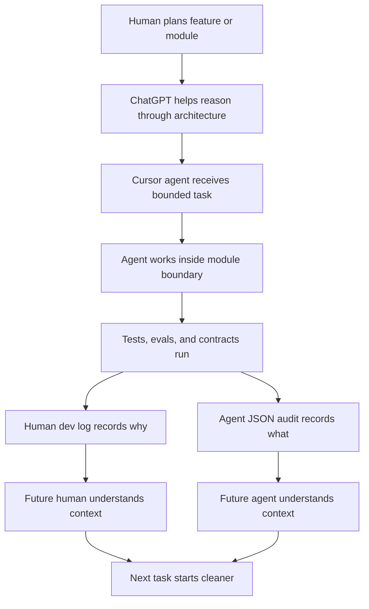
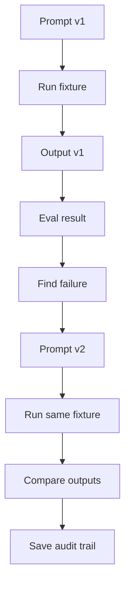

# @pukujan/create-modular-monolith

Architecture for agent-first modular monoliths.

This is not just an Express + React starter.

AI agents build fast. Really fast. But most repo structures still assume the old workflow: one human slowly edits code, remembers the context, and keeps the architecture from drifting.

That breaks down when Cursor agents, ChatGPT, OpenRouter models, prompt pipelines, eval scripts, generated files, and human review all work across the same project.

`@pukujan/create-modular-monolith` scaffolds a modular monolith built for that new workflow.

The goal is simple:

> Build fast with AI agents, but make the repo remember the work.

```bash
npm create @pukujan/modular-monolith@2.2.3 my-platform
cd my-platform
npm install --prefix backend && npm install --prefix frontend
npm run test:ci
```

## What this is

`@pukujan/create-modular-monolith` copies the `template/` folder into your chosen directory.

You get a platform for human + AI-agent engineering:

- **Modular monolith** with backend and frontend feature modules
- **Architecture contracts** so repo structure does not silently drift
- **File exchange** with dated imports and exports for human ↔ agent handoff
- **Versioned dev logs** for human-readable project memory
- **Agent audit logs** for machine-readable context between sessions
- **Prompt/versioning patterns** for prompt engineering workflows
- **Eval and CI gates** for regression checks and merge confidence
- **Cursor-native setup** with `AGENTS.md`, `.cursor/rules`, and `.cursor/commands`

Domain logic is yours.

```bash
npm run new:module -- billing --label "Billing"
```

## Why this exists

AI agents can now create APIs, refactor files, write tests, generate prompts, process data, and move through tickets quickly.

That speed is useful.

But without architecture, it creates new problems:

| Problem | Why it matters |
|---|---|
| Agents lose context | A new session does not know what changed or failed before |
| Humans cannot review everything deeply | Agents can generate more changes than a human can track manually |
| File handoff gets messy | Inputs and outputs get scattered across random folders |
| Module boundaries blur | Agents may edit too many areas at once |
| Prompt changes disappear | Nobody knows why prompt v2 is better than v1 |
| Eval results get lost | Terminal output and chat history are not enough |
| Architecture decisions stay in chat | The repo does not remember why it is shaped that way |
| Future agents repeat mistakes | There is no audit trail of what was rejected, fixed, or risky |

This package addresses those problems by making the repo itself part of the workflow.

## Core idea

The repo should not just store code.

It should store the memory of how the code was built.

That means preserving:

- what changed
- why it changed
- what failed
- what tests ran
- what files were imported
- what outputs were exported
- what prompt version was used
- what eval result was produced
- what the next agent should know

## How the architecture helps

| Architecture piece | What it solves |
|---|---|
| Modules | Keeps agent work bounded |
| Contracts | Prevents repo layout drift |
| Human dev logs | Explains decisions, risks, and failures |
| Agent JSON audit logs | Gives future agents structured memory |
| File exchange | Makes imports and exports traceable |
| Prompt versioning | Tracks prompt changes and reasons |
| Golden evals | Creates regression anchors for known fixtures |
| CI gates | Checks structure, tests, and evals before merge |
| Cursor rules | Gives coding agents project-specific instructions |

## Agent-first workflow



## File exchange

Agents should not guess where files are.

Every inbound bundle should go through a stamped import folder.

Every generated output should go through a stamped export folder.

```text
file-exchange/imports/{timestamp}/
file-exchange/exports/{timestamp}_{label}/
```

Example:

```bash
npm run import:file-exchange -- "/path/to/bundle"
npm run condense:all
```

This helps answer:

- where did the input come from?
- which version did the agent use?
- where did the output go?
- what should the next agent read?

## Dev logs and audit trail

Before pushing, run:

```bash
npm run dev-log:pre-push -- --slug my-feature
```

This creates two types of memory:

| Log | Format | Purpose |
|---|---|---|
| Human dev log | Markdown | Summary, reasoning, risks, failures, and next notes |
| Agent audit log | JSON | Changed files, test results, API inventory, metadata, machine-readable handoff |

Humans need narrative context.

Agents need structured context.

This package supports both.

## Prompt versioning and evals

Prompt engineering needs the same discipline as code.

A prompt version should not live only in a chat.

A serious prompt workflow should preserve:

- prompt version
- change note
- failure being fixed
- model used
- input fixture
- output snapshot
- eval result
- confidence score
- human review status

Golden evals are treated as regression anchors for known fixtures, not universal truth for every future case.



## Quick start

```bash
npm create @pukujan/modular-monolith@2.2.3 my-platform
cd my-platform

npm install --prefix backend
npm install --prefix frontend

npm run test:ci
```

Start development:

```bash
cp backend/.env.example backend/.env
cp frontend/.env.example frontend/.env

cd backend && npm run dev
# new terminal
cd frontend && npm run dev
```

## Key commands

| Command | Purpose |
|---|---|
| `npm run test:ci` | Run all local CI gates |
| `npm run new:module -- <name>` | Scaffold backend + frontend module |
| `npm run import:file-exchange -- <path>` | Import inbound files into stamped folder |
| `npm run condense:all` | Generate consolidated snapshots |
| `npm run dev-log:pre-push -- --slug <topic>` | Create human + agent dev log pair |
| `npm run lint:architecture` | Check architecture boundaries, layers, and API docs |
| `npm run lint:contracts` | Check registered architecture contract paths |

## What ships in `template/`

| Area | Contents |
|---|---|
| Backend | `backend/src/core/`, `modules/_reference`, `modules/model-condenser` |
| Frontend | `frontend/src/core/`, `modules/_reference` |
| Docs | `docs/architecture/`, guardrails, contracts, platform docs |
| Exchange | `file-exchange/imports/`, `file-exchange/exports/` |
| Work log | `work-log/dev-logs/human/`, `work-log/dev-logs/agent/`, JSON schema |
| CI | `.github/workflows/ci.yml` |
| Cursor | `AGENTS.md`, `.cursor/rules`, `.cursor/commands` |
| Scripts | Contract linting, module scaffolding, file exchange, condenser, dev logs |

Not included:

- domain batches
- litigation prompts
- committed golden evals
- customer-specific workflows

Add those per project when you curate real fixtures.

## Contract catalog

Registered in `template/docs/architecture/contracts/manifest.json`:

| Contract | Purpose |
|---|---|
| `fileExchange` | Dated imports and exports |
| `consolidatedExports` | Snapshot output paths |
| `prePushDevLog` | Paired human markdown + agent JSON |
| `apiDocumentationRegistry` | `docs/API.md` registry |
| `repoArtifactLayout` | Canonical project roots |

Add domain contracts inside your modules when you introduce project-specific pipelines, prompt layouts, eval folders, or storage rules.

## Package vs product repo

| Repo | Role |
|---|---|
| `create-modular-monolith` | This npm package. Architecture platform only. |
| `litigation-prompt-engineering` | Reference product with domain modules, prompts, evals, and case workflows. |

The package is the reusable platform layer.

The product repo stress-tests the architecture.

## Repository layout

```text
create-modular-monolith/
├── README.md
├── package.json
├── index.js
├── CHANGELOG.md
├── LICENSE
└── template/
    ├── README.md
    ├── AGENTS.md
    ├── docs/architecture/
    ├── file-exchange/
    ├── work-log/
    ├── backend/
    └── frontend/
```

## Publishing

Maintainers can sync platform changes from product repos through an architecture export workflow.

```bash
npm version patch
npm publish --access public
```

Requires npm authentication with publish access.

## License

Proprietary. All rights reserved.

You may use the npm scaffold to build your own apps. Attribution is required if you keep substantial platform files from the template.

See `LICENSE` and `template/NOTICE`.
