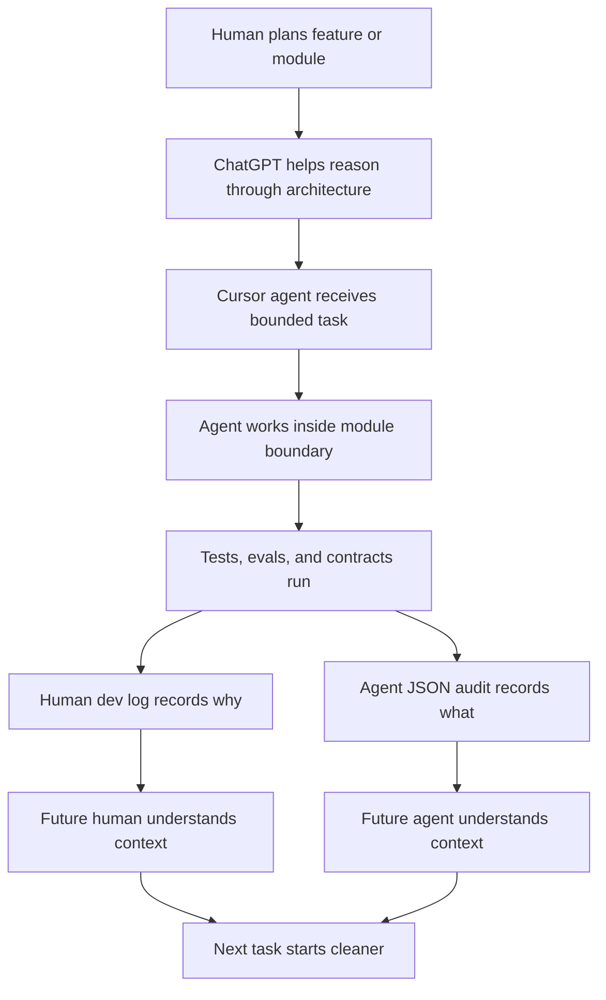
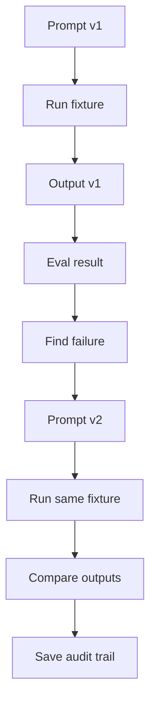

# @pukujan/create-modular-monolith

Architecture for agent-first modular monoliths.

This is not just an Express + React starter.

AI agents build fast. Really fast. But most repo structures still assume the old workflow: one human slowly edits code, remembers the context, and keeps the architecture from drifting.

That breaks down when Cursor agents, ChatGPT, OpenRouter models, prompt pipelines, eval scripts, generated files, and human review all work across the same project.

`@pukujan/create-modular-monolith` scaffolds a modular monolith built for that new workflow.

The goal is simple:

> Build fast with AI agents, but make the repo remember the work.

```bash
npm create @pukujan/create-modular-monolith@2.3.3 my-platform
cd my-platform
npm install --prefix backend && npm install --prefix frontend
npm run test:ci
```

## At a glance

| | |
| --- | --- |
| **npm package** | [`@pukujan/create-modular-monolith`](https://www.npmjs.com/package/@pukujan/create-modular-monolith) |
| **CLI binary** | `create-modular-monolith` |
| **Node** | 20+ (`engines` in `package.json`) |
| **Stack** | Express (backend) + React/Vite (frontend) |
| **Default ports** | Backend `3001`, frontend `5173` (Vite) |
| **Source** | [github.com/Pukujan/create-modular-monolith](https://github.com/Pukujan/create-modular-monolith) |
| **License** | [MIT](./LICENSE) — Copyright (c) 2026 Pukujan |

### Install

```bash
# Recommended (create-app style)
npm create @pukujan/create-modular-monolith@2.3.3 my-platform

# Equivalent
npx @pukujan/create-modular-monolith@2.3.3 my-platform
```

Pin a version in production docs (`@2.3.3`) so scaffolds do not change silently when `latest` moves.

### 2.3.3 — fixes in this release (2026-05-31)

These bugs affected **2.3.2 and earlier** scaffolds. **2.3.3** corrects them:

| Issue | Symptom | Fix |
| --- | --- | --- |
| **`plan:gate` CLI parsing** | Running `npm run plan:gate -- --slug my-plan` without `--plan-id` failed with a nonsense manifest path (e.g. `node.exe.json` on Windows) | Safe flag parsing in `parse-cli-args.mjs`; `--plan-id` now defaults to `--slug` |
| **`dev-log:pre-push` on starter** | `npm run dev-log:pre-push` crashed with `Cannot read properties of null` (pipeline / prompt registry) | Dev log generator handles boilerplate with no domain pipeline registry |
| **Planning folder split** | Study logs lived in `work-log/study-docs/` while manifests lived in `work-log/planning/` | All planning markdown + JSON manifests under **`work-log/planning/`** |
| **Manifest paths on Windows** | Finalize wrote backslash paths into planning manifests | Paths normalized to `work-log/planning/...` forward slashes |
| **`agent:push` on Windows** | `git commit -m "dev log: …"` failed with `pathspec 'log:' did not match` | Git subprocess runs without shell word-splitting |

**Also new in 2.3.3:** `npm run agent:push` (dev logs then push for Cursor agents), Cursor hook blocking bare agent `git push`, and `npm run smoke:gates` to verify planning + push gates. Terminal push by you stays optional without dev logs.

**Upgrade from 2.3.2:** scaffold a fresh app with `@2.3.3`, or copy the script/hook changes and move any `work-log/study-docs/*` files into `work-log/planning/`, then re-run `npm run plan:finalize`.

### After scaffold — required setup

```bash
cd my-platform

# 1. Dependencies (if you skipped install above)
npm install --prefix backend && npm install --prefix frontend

# 2. Environment
cp backend/.env.example backend/.env
cp frontend/.env.example frontend/.env

# 3. Optional: move heavy data outside the repo
cp local-artifacts.example.json local-artifacts.json
# edit artifactRoot + layout keys

# 4. Quality gate before first push
npm run test:ci
```

### What you get on disk

```text
my-platform/
├── AGENTS.md                 ← required reading for Cursor / agents
├── backend/src/
│   ├── core/                 ← module loader, server
│   ├── modules/_reference/   ← health-check example module
│   ├── modules/model-condenser/
│   └── shared/               ← contracts, agent-runtime, artifact paths
├── frontend/src/core/ + modules/_reference/
├── docs/architecture/        ← contracts, guardrails, templates/
├── file-exchange/            ← imports/ + exports/ (human ↔ agent handoff)
├── work-log/                 ← dev-logs, planning/
├── local-artifacts.example.json
└── package.json              ← root scripts (test:ci, condense:all, new:module, …)
```

Read **`docs/architecture/CONTRACTS_OVERVIEW.md`** and **`AGENTS.md`** before adding domain modules.

### Implementing 2.3.0 contracts (your code)

The npm package ships **specs + copy-paste templates**, not a running upload queue or BullMQ install:

| Goal | Start here |
| --- | --- |
| User uploads + DB | `docs/architecture/templates/document-persistence/` |
| Module AI agents (FSM) | `docs/architecture/templates/module-agent-state-machine/` + `backend/src/shared/agent-runtime/` |
| Background jobs | `docs/architecture/templates/async-job-queue/` (add `bullmq` + Redis when you wire workers) |
| Agent handoff bundle | `npm run condense-contracts` → `file-exchange/exports/consolidated-contracts.json` |

## What's new in 2.3.x

### 2.3.3 — planning folder + agent push gate (2026-05-31)

**Fixed**

- **`plan:gate` without `--plan-id`** — no longer resolves plan id to `process.argv[0]` (broken manifest paths on Windows)
- **`dev-log:pre-push` on boilerplate** — no crash when pipeline/prompt registries are absent
- **Planning paths** — study logs, plan packages, and finalize manifests all under `work-log/planning/` (removed split with `study-docs/`)
- **Windows path + git commit issues** — planning manifest paths and `agent:push` commit messages

**Added**

- `npm run agent:push` — create dev logs, commit pair, push (for Cursor agent workflows)
- `.cursor/hooks.json` — blocks bare agent `git push` until paired dev logs exist on `HEAD`
- `npm run smoke:gates` — smoke tests for planning gate and push gate

### 2.3.0 — architecture contracts

Architecture contracts and templates for the next layer of agent-ready apps (spec only — you wire runtime when ready):

| Contract | What you get |
| --- | --- |
| **documentPersistence** | Uploads on disk (`data/uploads/`) + SQL metadata/parsed text; separate from file-exchange |
| **moduleAgentStateMachine** | Per-module FSM in `agents/*.machine.js` + shared `createAgentRuntime` |
| **asyncJobQueue** | BullMQ + Redis pattern for background jobs; SQL stays source of truth |

Also in this release:

- `npm run condense-contracts` (and `condense:all`) exports a full **consolidated-contracts.json** handoff bundle
- `local-artifacts.example.json` for moving heavy folders outside the repo
- Module scaffold adds an **`agents/`** layer; `CONTRACTS_OVERVIEW` lists all **9** starter manifest contracts
- Implementation guides under `docs/architecture/templates/{document-persistence,module-agent-state-machine,async-job-queue}/`

### 2.3.1 — documentation

- Expanded npm **README** (install, env vars, post-scaffold layout, maintainer publish steps)
- Registry `description` / `keywords` updated in `package.json`

See [CHANGELOG.md](./CHANGELOG.md) for the full list.

## What this is

`@pukujan/create-modular-monolith` copies the `template/` folder into your chosen directory.

You get a platform for human + AI-agent engineering:

- **Modular monolith** with backend and frontend feature modules
- **Architecture contracts** so repo structure does not silently drift
- **File exchange** with dated imports and exports for human ↔ agent handoff
- **Versioned dev logs** for human-readable project memory
- **Agent audit logs** for machine-readable context between sessions
- **Prompt/versioning patterns** for prompt engineering workflows
- **Eval and CI gates** for regression checks and merge confidence
- **Cursor-native setup** with `AGENTS.md`, `.cursor/rules`, and `.cursor/commands`

Domain logic is yours.

```bash
npm run new:module -- billing --label "Billing"
```

## Why this exists

AI agents can now create APIs, refactor files, write tests, generate prompts, process data, and move through tickets quickly.

That speed is useful.

But without architecture, it creates new problems:

| Problem | Why it matters |
|---|---|
| Agents lose context | A new session does not know what changed or failed before |
| Humans cannot review everything deeply | Agents can generate more changes than a human can track manually |
| File handoff gets messy | Inputs and outputs get scattered across random folders |
| Module boundaries blur | Agents may edit too many areas at once |
| Prompt changes disappear | Nobody knows why prompt v2 is better than v1 |
| Eval results get lost | Terminal output and chat history are not enough |
| Architecture decisions stay in chat | The repo does not remember why it is shaped that way |
| Future agents repeat mistakes | There is no audit trail of what was rejected, fixed, or risky |

This package addresses those problems by making the repo itself part of the workflow.

## Core idea

The repo should not just store code.

It should store the memory of how the code was built.

That means preserving:

- what changed
- why it changed
- what failed
- what tests ran
- what files were imported
- what outputs were exported
- what prompt version was used
- what eval result was produced
- what the next agent should know

## How the architecture helps

| Architecture piece | What it solves |
|---|---|
| Modules | Keeps agent work bounded |
| Contracts | Prevents repo layout drift |
| Human dev logs | Explains decisions, risks, and failures |
| Agent JSON audit logs | Gives future agents structured memory |
| File exchange | Makes imports and exports traceable |
| Prompt versioning | Tracks prompt changes and reasons |
| Golden evals | Creates regression anchors for known fixtures |
| CI gates | Checks structure, tests, and evals before merge |
| Cursor rules | Gives coding agents project-specific instructions |

## Agent-first workflow



## File exchange

Agents should not guess where files are.

Every inbound bundle should go through a stamped import folder.

Every generated output should go through a stamped export folder.

```text
file-exchange/imports/{timestamp}/
file-exchange/exports/{timestamp}_{label}/
```

Example:

```bash
npm run import:file-exchange -- "/path/to/bundle"
npm run condense:all
```

This helps answer:

- where did the input come from?
- which version did the agent use?
- where did the output go?
- what should the next agent read?

## Dev logs and audit trail

Before pushing, run:

```bash
npm run dev-log:pre-push -- --slug my-feature
```

This creates two types of memory:

| Log | Format | Purpose |
|---|---|---|
| Human dev log | Markdown | Summary, reasoning, risks, failures, and next notes |
| Agent audit log | JSON | Changed files, test results, API inventory, metadata, machine-readable handoff |

Humans need narrative context.

Agents need structured context.

This package supports both.

## Prompt versioning and evals

Prompt engineering needs the same discipline as code.

A prompt version should not live only in a chat.

A serious prompt workflow should preserve:

- prompt version
- change note
- failure being fixed
- model used
- input fixture
- output snapshot
- eval result
- confidence score
- human review status

Golden evals are treated as regression anchors for known fixtures, not universal truth for every future case.



## Quick start

```bash
npm create @pukujan/create-modular-monolith@2.3.3 my-platform
cd my-platform

npm install --prefix backend
npm install --prefix frontend

npm run test:ci
```

Start development:

```bash
cp backend/.env.example backend/.env
cp frontend/.env.example frontend/.env

cd backend && npm run dev
# new terminal
cd frontend && npm run dev
```

## Key commands

| Command | Purpose |
|---|---|
| `npm run test:ci` | Run all local CI gates |
| `npm run new:module -- <name>` | Scaffold backend + frontend module |
| `npm run import:file-exchange -- <path>` | Import inbound files into stamped folder |
| `npm run condense:all` | Generate consolidated snapshots (models, prompts, file tree, contracts) |
| `npm run condense-contracts` | Export full architecture contract bundle only |
| `npm run dev-log:pre-push -- --slug <topic>` | Create human + agent dev log pair |
| `npm run lint:architecture` | Check architecture boundaries, layers, and API docs |
| `npm run lint:contracts` | Check registered architecture contract paths |
| `npm run plan:gate` | Planning phase gate (study log required) |
| `npm run plan:finalize` | Finalize planning artifacts |

## Environment variables (starter)

| Variable | Where | Purpose |
| --- | --- | --- |
| `PORT` | `backend/.env` | API port (default `3001`) |
| `DATABASE_URL` | `backend/.env` | Postgres/SQLite when you add persistence |
| `REDIS_URL` | `backend/.env` | BullMQ backend when you implement `asyncJobQueue` |
| `UPLOADS_ROOT` | `backend/.env` | Override upload path (see `documentPersistence` contract) |
| `VITE_API_BASE_URL` | `frontend/.env` | Frontend → backend URL |

See `backend/.env.example` and `docs/architecture/REPO_ARTIFACT_LAYOUT.md` after scaffold.

## What ships in `template/`

| Area | Contents |
|---|---|
| Backend | `backend/src/core/`, `modules/_reference`, `modules/model-condenser` |
| Frontend | `frontend/src/core/`, `modules/_reference` |
| Docs | `docs/architecture/`, guardrails, contracts, platform docs |
| Exchange | `file-exchange/imports/`, `file-exchange/exports/` |
| Work log | `work-log/dev-logs/human/`, `work-log/dev-logs/agent/`, JSON schema |
| CI | `.github/workflows/ci.yml` |
| Cursor | `AGENTS.md`, `.cursor/rules`, `.cursor/commands` |
| Scripts | Contract linting, module scaffolding, file exchange, condenser, dev logs |
| Shared runtime | `createAgentRuntime`, `resolveArtifactPaths`, `resolveDocumentStoragePaths` |

Not included:

- domain batches
- litigation prompts
- committed golden evals
- customer-specific workflows

Add those per project when you curate real fixtures.

## Contract catalog

Registered in `template/docs/architecture/contracts/manifest.json` (**9** starter contracts):

| Contract | Purpose |
|---|---|
| `repoArtifactLayout` | Canonical roots + optional `local-artifacts.json` |
| `fileExchange` | Dated imports and exports |
| `consolidatedExports` | `condense:all` / `condense-contracts` output paths |
| `planningPhase` | `work-log/planning/`, `plan:gate`, `plan:finalize` |
| `prePushDevLog` | Paired human markdown + agent JSON |
| `apiDocumentationRegistry` | `docs/API.md` registry |
| `documentPersistence` | Runtime uploads + DB (not file-exchange) |
| `moduleAgentStateMachine` | Per-module agent FSM + shared runtime |
| `asyncJobQueue` | BullMQ + Redis for async jobs |

Detail: `template/docs/architecture/CONTRACTS_OVERVIEW.md` after scaffold.

Add domain contracts inside your modules when you introduce project-specific pipelines, prompt layouts, eval folders, or storage rules.

## Package vs product repo

| Repo | Role |
|---|---|
| `create-modular-monolith` | This npm package. Architecture platform only. |
| `litigation-prompt-engineering` | Reference product with domain modules, prompts, evals, and case workflows. |

The package is the reusable platform layer.

The product repo stress-tests the architecture.

## Repository layout

```text
create-modular-monolith/
├── README.md
├── package.json
├── index.js
├── CHANGELOG.md
├── LICENSE
└── template/
    ├── README.md
    ├── AGENTS.md
    ├── docs/architecture/
    ├── file-exchange/
    ├── work-log/
    ├── backend/
    └── frontend/
```

## Publishing (maintainers)

### Sync template from a product repo (optional)

```bash
# In legal-prmpt-eng (or your product repo)
npm run export:architecture-starter -- --to /absolute/path/to/create-modular-monolith/template
```

### Publish to npm

npm shows **`README.md` from the package root** on [the package page](https://www.npmjs.com/package/@pukujan/create-modular-monolith). You cannot edit that page in the browser — **publish a new version** with an updated root `README.md`.

```bash
cd create-modular-monolith

# 1. Edit README.md + CHANGELOG.md, bump version in package.json
# 2. Commit and push to GitHub
git add README.md CHANGELOG.md package.json
git commit -m "docs: release notes for v2.3.x"
git push origin main

# 3. Login (browser flow is fine)
npm login

# 4. Publish — README ships inside the tarball automatically
npm publish --access public
# If npm asks for a code: use authenticator OTP or complete the CLI browser link
```

Verify:

```bash
npm view @pukujan/create-modular-monolith version
npm view @pukujan/create-modular-monolith readme | head -20
```

**Patch release tip:** If `2.3.0` is already on npm without the latest README, bump to `2.3.1`, publish again — registry README updates with the new version’s tarball.

Product-repo architecture export audit (separate from this package): see `template/docs/architecture/contracts/architecturePushDevLog.contract.md` (maintainer repo only).

## License

[MIT License](./LICENSE) — Copyright (c) 2026 Pukujan.

Scaffolded projects receive the same `LICENSE` in `template/`. Optional credit: `template/NOTICE`.
