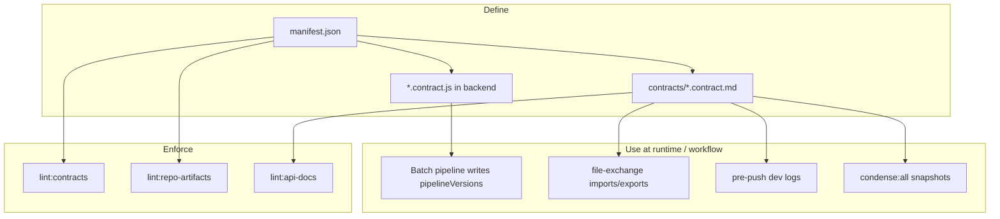
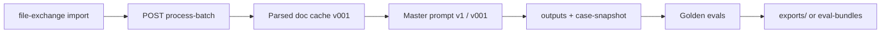

# Architecture contracts — how it works

**One-page map** of repo contracts: what they are, how they connect, and how they are enforced.

| Quick links | |
|-------------|---|
| **Index (machine)** | [contracts/manifest.json](./contracts/manifest.json) |
| **History** | [contracts/changelog.jsonl](./contracts/changelog.jsonl) |
| **Paths on disk** | [REPO_ARTIFACT_LAYOUT.md](./REPO_ARTIFACT_LAYOUT.md) |
| **Lint** | `npm run lint:contracts` · `npm run lint:repo-artifacts` |

---

## What “contract” means here

A **contract** is a versioned agreement about paths, filenames, API shapes, or pipeline metadata. It can be:

| Form | Example |
|------|---------|
| **Markdown spec** | `docs/architecture/contracts/prePushDevLog.contract.md` |
| **JS constants** | `backend/src/modules/case-filing-ai/contracts/pipelineVersions.js` |
| **Registry doc** | `docs/API.md` endpoint table |

Contracts are **not** runtime filing data. They tell humans and agents where artifacts live and which versions are current.

---

## The contract pipeline (repo level)



### 1. Register — `manifest.json`

Every contract has an entry with:

- `version` (e.g. `v001`)
- `doc` — human-readable spec (required for new contracts)
- `file` / `utility` / `schema` / scripts — paths lint must verify exist

**Source of truth for “what contracts exist”:** [contracts/manifest.json](./contracts/manifest.json)

### 2. Document — `contracts/*.contract.md`

Each entry’s `doc` explains purpose, paths, commands, and related contracts.

### 3. Implement — `*.contract.js` (where needed)

Code exports version strings and path constants so services and scripts share one definition:

| File | Exports |
|------|---------|
| `pipelineVersions.js` | `buildPipelineVersions()` on batch outputs |
| `storageLayout.contract.js` | `BATCH_LAYOUT_VERSION`, folder names |
| `parsedDocumentArtifacts.contract.js` | Parsed cache filenames |
| `prePushDevLog.contract.js` | Dev-log paths, tree ignores, npm scripts |
| `consolidatedExports.contract.js` | `file-exchange/exports/consolidated-*.json` |

### 4. Record changes — `changelog.jsonl`

One JSON line per bump: `contract`, `from`, `to`, `reason`, `time`.

### 5. Enforce — npm lint scripts

| Command | Checks |
|---------|--------|
| `npm run lint:contracts` | Every path listed in `manifest.json` exists |
| `npm run lint:repo-artifacts` | Key folders + contract docs + golden stub paths |
| `npm run lint:api-docs` | Routes in code ⊆ `docs/API.md` registry |

---

## Contract catalog (current)

| ID | Version | What it governs |
|----|---------|-----------------|
| **repoArtifactLayout** | v001 | All canonical roots (`data/`, `evals/`, `file-exchange/`, `work-log/`) |
| **fileExchange** | v001 | `imports/{stamp}/`, `exports/{stamp}/`, human-readable UTC stamps |
| **consolidatedExports** | v001 | `exports/consolidated-*.json` + `consolidated-files/` mirror, `condense:all` |
| **prePushDevLog** | v001 | Paired `human/*.md` + `agent/*.json`, tree/API/test audits |
| **apiDocumentationRegistry** | v001 | `docs/API.md`, active/stub/deprecated routes |
| **caseFilingStorageLayout** | v001 | `batches/batch-NNN/` folder layout |
| **parsedDocumentArtifacts** | v001 | `parsed-documents/doc-NNN/` file names |
| **pipelineVersions** | v001 | Version blob on batch outputs (prompt, parser, golden, …) |
| **ruleAuthority** | v001 | Court rule authority ranks |

Per-contract detail: follow the `doc` link in [manifest.json](./contracts/manifest.json).

---

## Case-filing **processing** pipeline (runtime)

This is separate from the **contract** pipeline above but uses contract versions:



Version defaults come from `pipelineVersions.js` + env `MASTER_PROMPT_VERSION`.  
Batch folders follow `storageLayout.contract.js`.  
HTTP entrypoint: `POST /api/case-filing-ai/process-batch` ([API.md](../API.md)).

---

## Human ↔ agent workflows (contract-driven)

| When | Command | Contract |
|------|---------|----------|
| Inbound files | `npm run import:file-exchange` | fileExchange |
| Before push | `npm run dev-log:pre-push` | prePushDevLog |
| Snapshot handoff | `npm run condense:all` | consolidatedExports |
| Clear dated exchange folders | `npm run clear:file-exchange` or `POST /api/file-exchange/clear` | fileExchange |
| Golden refresh | `npm run ingest:golden-*` | fileExchange + pipelineVersions |

---

## Related architecture docs (not in manifest)

| Doc | Scope |
|-----|--------|
| [ARCHITECTURE_GUARDRAILS.md](./ARCHITECTURE_GUARDRAILS.md) | Module boundaries, loader, lint:boundaries |
| [MODULE_INTERNAL_CONTRACT.md](./MODULE_INTERNAL_CONTRACT.md) | Inside one module (routes, services, prompts) |
| [API_DOCUMENTATION_CONTRACT.md](./API_DOCUMENTATION_CONTRACT.md) | How to maintain `docs/API.md` |

---

## Exporting architecture to the npm starter

To refresh the **boilerplate CLI template** without domain modules:

```bash
npm run export:architecture-starter -- --to packages/create-modular-monolith/template
```

Templates: `file-exchange/exports/templates/`. Output defaults to `file-exchange/exports/architecture-starter/` (gitignored). See `EXPORT_MANIFEST.json` and [PUBLISHING.md](../PUBLISHING.md).

---

## Adding a new contract

1. Add `docs/architecture/contracts/<name>.contract.md`
2. Add JS constants under `backend/.../contracts/` if code needs them
3. Add entry to [manifest.json](./contracts/manifest.json) with all paths
4. Append line to [changelog.jsonl](./contracts/changelog.jsonl)
5. Update [REPO_ARTIFACT_LAYOUT.md](./REPO_ARTIFACT_LAYOUT.md) if new roots
6. Run `npm run lint:contracts` and `npm run lint:repo-artifacts`
