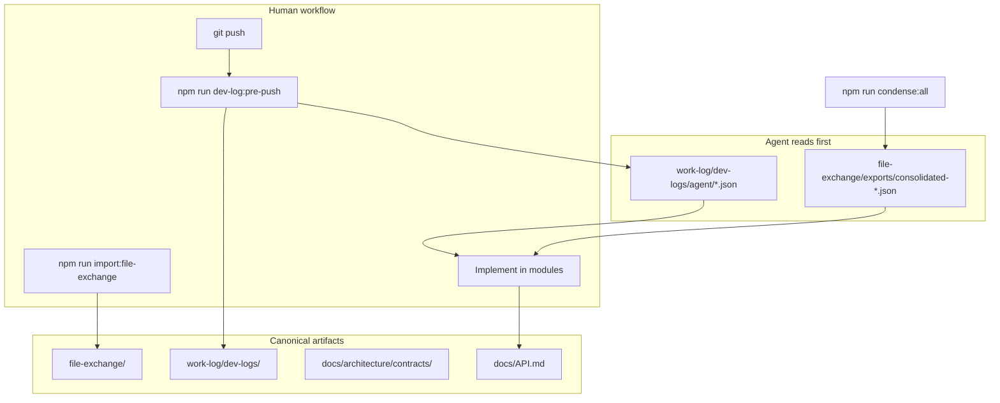
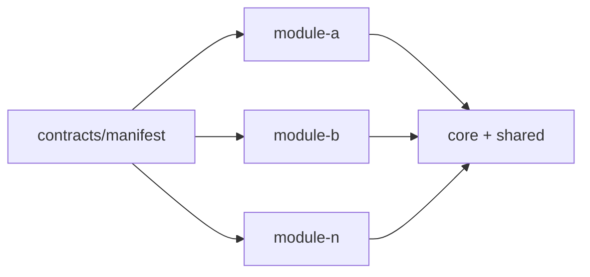

# Platform architecture — built for agents and engineering at scale

This starter is designed so **Cursor agents, CI, and humans** share the same map of the repository. Business features are added as modules; the **platform layer** stays stable.

---

## Design goals

| Goal | Mechanism |
|------|-----------|
| **Agents know where files go** | `REPO_ARTIFACT_LAYOUT.md`, `file-exchange/`, contract manifest |
| **Agents know what changed** | Pre-push dev log: Part I summary (mermaid, tables) + Part II detail + full tree |
| **Agents know which APIs exist** | `docs/API.md` registry + `api-inventory` in every dev log |
| **No silent drift** | `lint:contracts`, `lint:api-docs`, `lint:repo-artifacts` |
| **Handoff without chaos** | Dated `file-exchange/imports/{stamp}/` — never process from `Downloads/` |
| **Onboarding in one read** | `condense:all` → consolidated models, prompts, file tree in `exports/` |

---

## System map



---

## Modular monolith core

```text
backend/src/core/          module-loader → register(app)
backend/src/modules/*      one feature = one folder
frontend/src/core/         App shell + moduleRegistry
frontend/src/modules/*     one route module per feature
```

**Rules** (enforced by `lint:boundaries`, `lint:layers`):

- Modules import `shared/`, not other modules.
- Backend: routes → services → repositories/domain.
- Every new route appears in `docs/API.md`.

Scaffold: `npm run new:module -- my-feature --label "My Feature"`

---

## Contract pipeline

See [CONTRACTS_OVERVIEW.md](./CONTRACTS_OVERVIEW.md).

1. **Register** in `contracts/manifest.json`
2. **Document** in `contracts/*.contract.md`
3. **Implement** in `*.contract.js` when code needs constants
4. **Changelog** in `contracts/changelog.jsonl`
5. **Lint** with `npm run lint:contracts`

Contracts version independently (e.g. `fileExchange` v001, `prePushDevLog` v001).

---

## File exchange (agent inbox)

```text
file-exchange/imports/2026-05-23_15-59-43Z/    ← inbound only
file-exchange/exports/2026-05-23_16-00-00Z/    ← session outputs
file-exchange/exports/consolidated-*.json      ← repo snapshots
```

Stamp format: `YYYY-MM-DD_HH-MM-SSZ` via `formatExchangeTimestamp()`.

**Cursor rule** (`.cursor/rules/file-exchange-inbox.mdc`, `alwaysApply: true`) makes import mandatory before processing user files.

---

## Pre-push dev log (audit trail)

**Before every push:**

```bash
npm run dev-log:pre-push -- --slug <kebab-topic>
```

| File | Audience | Contents |
|------|----------|----------|
| `human/*_dev-log_*.md` | Humans | Part I: TOC, mermaid, API/version/test/git tables, condensed tree. Part II: decisions, iterations, full tree |
| `agent/*_dev-log-agent_*.json` | Agents | Same facts in structured JSON — read this first when resuming |

Tree capture ignores: `node_modules`, `.git`, `dist`, `build` (equivalent to `tree -I "node_modules|.git|dist|build"`).

Works **without git** until `git init`; then git sections auto-fill.

---

## Consolidated exports (repository X-ray)

```bash
npm run condense:all
```

| Output | Purpose |
|--------|---------|
| `consolidated-models.json` | Schema inventory (model-condenser) |
| `consolidated-prompts.json` | All prompt templates + manifests |
| `consolidated-file-structure.json` | Full file tree + stats |

Primary handoff path: `file-exchange/exports/`. Mirror: `models/` for API compatibility.

---

## Automation scripts reference

### Governance (run in CI)

| Command | Script |
|---------|--------|
| `npm run lint:contracts` | `scripts/lint-contracts.mjs` |
| `npm run lint:repo-artifacts` | `scripts/lint-repo-artifacts.mjs` |
| `npm run lint:api-docs` | `scripts/check-api-docs.mjs` |
| `npm run lint:architecture` | boundaries + layers + api-docs |

### Agent / session workflow

| Command | Script |
|---------|--------|
| `npm run import:file-exchange` | `scripts/import-to-file-exchange.mjs` |
| `npm run dev-log:pre-push` | `scripts/write-pre-push-dev-log.mjs` |
| `npm run dev-log:verify` | `scripts/verify-dev-log.mjs` |
| `npm run condense:all` | condense-prompts + file-structure + condense-models |

### Scaffolding

| Command | Script |
|---------|--------|
| `npm run new:module` | `scripts/new-module.mjs` |

---

## Scaling to many modules



Adding a module does **not** change the platform contracts. You:

1. Run `new:module`
2. Add rows to `docs/API.md`
3. Register prompts in `prompts/manifest.json`
4. Run `dev-log:pre-push` before push

The condenser and dev-log scripts scan the **whole repo** — new modules appear automatically in the next tree and API inventory.

---

## Cursor integration

| File | Role |
|------|------|
| `AGENTS.md` | Mandatory workflows for agents |
| `.cursor/commands/pre-push-dev-log.md` | How to fill dev logs |
| `.cursor/commands/planning-study-log.md` | Planning-only study logs |
| `.cursor/rules/file-exchange-inbox.mdc` | alwaysApply import discipline |
| `.cursor/rules/api-documentation.mdc` | Keep API docs in sync |

---

## What to read first (agents)

1. `work-log/dev-logs/agent/` — latest `*_dev-log-agent_*.json`
2. `file-exchange/exports/consolidated-file-structure.json` — layout
3. `docs/architecture/CONTRACTS_OVERVIEW.md` — contract index
4. `docs/API.md` — HTTP surface
5. `AGENTS.md` — required commands

---

## Related docs

- [CONTRACTS_OVERVIEW.md](./CONTRACTS_OVERVIEW.md)
- [REPO_ARTIFACT_LAYOUT.md](./REPO_ARTIFACT_LAYOUT.md)
- [ARCHITECTURE_GUARDRAILS.md](./ARCHITECTURE_GUARDRAILS.md)
- [MODULE_INTERNAL_CONTRACT.md](./MODULE_INTERNAL_CONTRACT.md)
- [../STARTER_PACK.md](../STARTER_PACK.md)
