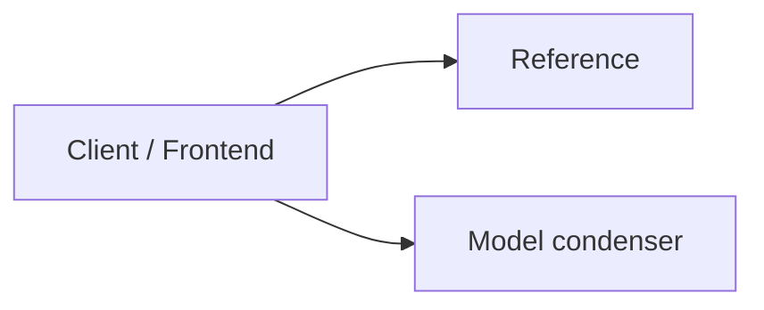
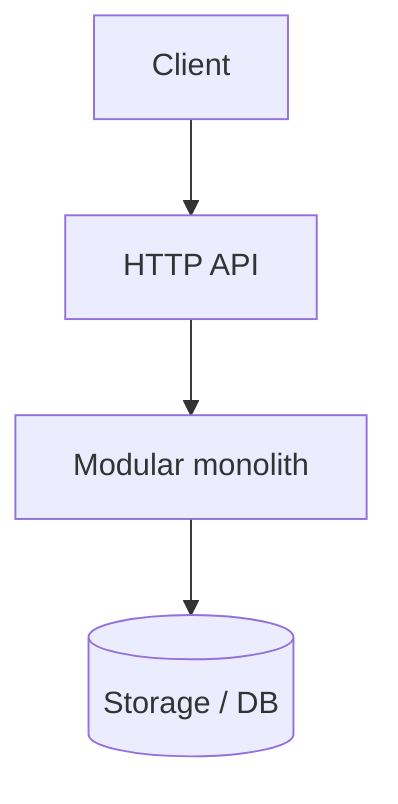
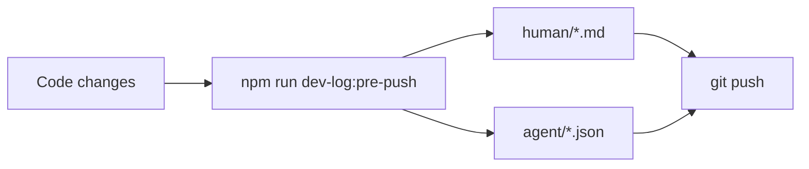

# Dev log (human): planning push gates

| Field | Value |
|-------|--------|
| **Entry** | 005 |
| **Date** | 2026-05-31 |
| **Time** | 04-44 |
| **Filename** | `005_2026-05-31_04-44_dev-log_planning-push-gates.md` |
| **Agent audit** | [005_2026-05-31_04-44_dev-log-agent_planning-push-gates.json](../agent/005_2026-05-31_04-44_dev-log-agent_planning-push-gates.json) |
| **Git** | `main` @ `6284b77` |

## Table of contents

### [Part I — Summary](#part-i-summary) _(read first)_
- [I.1 At a glance](#i1-at-a-glance)
- [I.2 Diagrams](#i2-diagrams)
- [I.3 API surface (summary)](#i3-api-surface-summary)
- [I.4 Version & prompt audit](#i4-version-prompt-audit)
- [I.5 Test audit](#i5-test-audit)
- [I.6 Git audit](#i6-git-audit)
- [I.7 Repository shape](#i7-repository-shape)

### [Part II — Detailed](#part-ii-detailed) _(full audit trail)_
- [II.1 Goals and scope](#ii1-goals-and-scope)
- [II.2 Decisions](#ii2-decisions)
- [II.3 Changes by area](#ii3-changes-by-area)
- [II.4 Iterations](#ii4-iterations)
- [II.5 Tests (detail)](#ii5-tests-detail)
- [II.6 What got better / trade-offs / risks](#ii6-outcomes)
- [II.7 Follow-ups](#ii7-follow-ups)
- [II.8 APIs (full registry)](#ii8-apis-full-registry)
- [II.9 Git snapshot (full)](#ii9-git-snapshot-full)
- [II.10 Repository tree (full)](#repository-tree-full)

---

## Part I — Summary {#part-i-summary}

> **Purpose:** One-screen picture for reviewers — APIs, versions, tests, git, repo shape.  
> **Detail:** [Part II](#part-ii-detailed) below.

### I.1 At a glance {#i1-at-a-glance}

Consolidated planning artifacts into `work-log/planning/`, fixed the plan gate CLI bug, and added agent push enforcement with `agent:push`, Cursor hooks, and `smoke:gates`. All smoke tests pass. No blockers.

### I.2 Diagrams {#i2-diagrams}

**HTTP modules (active + stub)**



**Pipeline versions (defaults at push)**



**Pre-push dev log flow**



### I.3 API surface (summary) {#i3-api-surface-summary}

| Kind | Count | Notes |
|------|------:|-------|
| Active HTTP routes | 4 | Case-filing-ai + condenser + pipeline |
| Stub modules (health only) | 0 | Workflow, court-rules, vault, review, docketing |
| Deprecated HTTP | 0 | From docs/API.md descriptions |
| Deprecated CLI | 0 | See version audit |

**Key routes this program:**

| Method | Path |
|--------|------|
| GET | `/api/model-condenser/health` |
| POST | `/api/model-condenser/condense` |
| GET | `/api/model-condenser/consolidated` |

_Session API changes not in docs/API.md — FILL in [II.8](#ii8-apis-full-registry)._

### I.4 Version & prompt audit {#i4-version-prompt-audit}

| Contract | Version | Status |
|----------|---------|--------|
| App (package.json) | 2.0.0 | current |
| Architecture contracts | manifest.json | see docs/architecture/CONTRACTS_OVERVIEW.md |
| Domain pipeline / prompts | — | not registered in starter template |

### I.5 Test audit {#i5-test-audit}

| Status | Value |
|--------|-------|
| Tests | _not run_ (`--no-tests` or fill after run) |

### I.6 Git audit {#i6-git-audit}

| Field | Value |
|-------|-------|
| Branch | `main` |
| Commit | `6284b77` (`6284b77c7e1e43e39b715c77ab39e7db6c666e2c`) |
| Changed paths (porcelain) | 0 |
| Recent commits | 5 listed below |

### I.7 Repository shape {#i7-repository-shape}

| Metric | Value |
|--------|------:|
| Files | 198 |
| Directories | 98 |
| Tree ignores | node_modules, .git, dist, build |
| Top extensions | .js (77), .md (44), .mjs (37), .json (12), (no extension) (11) |

_Condensed tree (full tree in [II.10](#repository-tree-full)):_

```text
C:\Users\pujan\OneDrive\Desktop\web dev\webdev 2.0\create-modular-monolith\template/
├── .gitignore
├── AGENTS.md
├── ARCHITECTURE_EXPORT_README.md
├── EXPORT_MANIFEST.json
├── LICENSE
├── local-artifacts.example.json
├── NOTICE
├── package.json
├── README.md
├── .cursor/
│   ├── hooks.json
│   ├── commands/
│   │   ├── architecture-push-log.md
│   │   ├── planning-study-log.md
│   │   ├── pre-push-dev-log.md
│   │   └── push.md
│   ├── hooks/
│   │   └── before-agent-push.mjs
│   └── rules/
│       ├── agent-push-dev-log.mdc
│       ├── api-documentation.mdc
│       └── file-exchange-inbox.mdc
├── .github/
│   └── workflows/
│       └── ci.yml
├── backend/
│   ├── .env.example
│   ├── package-lock.json
│   ├── package.json
│   ├── db/
│   │   └── migrations/
│   │       └── .gitkeep
│   ├── scripts/
│   │   ├── check-module-boundaries.mjs
│   │   └── check-module-layers.mjs
│   └── src/
│       ├── core/
│       │   ├── module-loader.js
│       │   └── server.js
│       ├── modules/
│       │   ├── .gitkeep
│       │   ├── _reference/
│       │   │   ├── index.js
│       │   │   ├── README.md
│       │   │   ├── adapters/
│       │   │   │   └── README.md
│       │   │   ├── config/
│   └── … (249 more lines — [full tree](#repository-tree-full))
```

---

## Part II — Detailed {#part-ii-detailed}

> **Purpose:** Decisions, iterations, narrative, and full machine-captured snapshots.

### II.1 Goals and scope {#ii1-goals-and-scope}

- **In scope:** Planning folder move, plan gate fix, agent push gate, smoke tests, docs and export script updates.
- **Out of scope:** npm version bump, architecture-push logs, domain modules.

### II.2 Decisions {#ii2-decisions}

| ID | Decision | Rationale | Alternatives rejected |
|----|----------|-----------|------------------------|
| D1 | Consolidate planning under work-log/planning/ | Matches contract mental model | study-docs/ split |
| D2 | Agent-only push dev log enforcement | User requested terminal push freedom | Block all pushes via git hook |

### II.3 Changes by area {#ii3-changes-by-area}

#### Backend / API
- No HTTP route changes.

#### Frontend
- No frontend changes.

#### Data / contracts / prompts
- Updated planningPhase and prePushDevLog contracts; manifest.json workLogReadme path.

#### Tooling / CI / docs
- agent:push, smoke:gates, Cursor hooks, AGENTS.md, export-architecture-starter.mjs.

### II.4 Iterations {#ii4-iterations}

1. **Attempt 1** — Fixed plan:gate argv bug → smoke planning gate passes
2. **Attempt 2** — Fixed dev-log format nulls → agent:push smoke passes

### II.5 Tests (detail) {#ii5-tests-detail}

#### Passed
- `npm run smoke:gates` (planning + push gate checks)

#### Failed
- none (--no-tests for full npm test in this log)

### II.6 What got better / trade-offs / risks {#ii6-outcomes}

**Better**
- Planning and push gates testable via smoke:gates; agent push workflow documented.

**Trade-offs**
- Cursor UI Push bypasses shell hook; manual terminal push still allowed without dev logs.

**Regressions / risks**
- Legacy study-docs/ paths need migration in existing projects.

### II.7 Follow-ups {#ii7-follow-ups}

- [ ] Add smoke:gates to CI workflow (optional)

### II.8 APIs (full registry) {#ii8-apis-full-registry}

### HTTP — active

| Method | Path | Module | Description |
|--------|------|--------|-------------|
| GET | `/api/_reference/health` | Reference | Example module health |
| GET | `/api/model-condenser/health` | Model condenser | Module health |
| POST | `/api/model-condenser/condense` | Model condenser | Regenerate consolidated-models.json |
| GET | `/api/model-condenser/consolidated` | Model condenser | Read consolidated schema inventory |

### HTTP — stub (health only)

_none_

### HTTP — deprecated

_none registered in docs/API.md_

### II.9 Git snapshot (full) {#ii9-git-snapshot-full}

**Changed files (porcelain)**

```
(clean)
```

**Diff stat vs HEAD**

```
(no diff)
```

**Recent commits**

```
6284b77 feat: consolidate planning artifacts and enforce agent push dev logs
cd2d6e4 feat: postinstall message linking to GitHub and npm
b938fd7 license: switch to MIT and release v2.3.2
37e9768 release: v2.3.1 npm README and package metadata
3797ab3 docs: add 2.3.0 release notes to README and CHANGELOG
```

### II.10 Repository tree (full) {#repository-tree-full}

_Ignores: `node_modules`, `.git`, `dist`, `build` — equivalent to `tree -I "node_modules|.git|dist|build"`._

```text
C:\Users\pujan\OneDrive\Desktop\web dev\webdev 2.0\create-modular-monolith\template/
├── .gitignore
├── AGENTS.md
├── ARCHITECTURE_EXPORT_README.md
├── EXPORT_MANIFEST.json
├── LICENSE
├── local-artifacts.example.json
├── NOTICE
├── package.json
├── README.md
├── .cursor/
│   ├── hooks.json
│   ├── commands/
│   │   ├── architecture-push-log.md
│   │   ├── planning-study-log.md
│   │   ├── pre-push-dev-log.md
│   │   └── push.md
│   ├── hooks/
│   │   └── before-agent-push.mjs
│   └── rules/
│       ├── agent-push-dev-log.mdc
│       ├── api-documentation.mdc
│       └── file-exchange-inbox.mdc
├── .github/
│   └── workflows/
│       └── ci.yml
├── backend/
│   ├── .env.example
│   ├── package-lock.json
│   ├── package.json
│   ├── db/
│   │   └── migrations/
│   │       └── .gitkeep
│   ├── scripts/
│   │   ├── check-module-boundaries.mjs
│   │   └── check-module-layers.mjs
│   └── src/
│       ├── core/
│       │   ├── module-loader.js
│       │   └── server.js
│       ├── modules/
│       │   ├── .gitkeep
│       │   ├── _reference/
│       │   │   ├── index.js
│       │   │   ├── README.md
│       │   │   ├── adapters/
│       │   │   │   └── README.md
│       │   │   ├── config/
│       │   │   │   └── index.js
│       │   │   ├── domain/
│       │   │   │   └── README.md
│       │   │   ├── events/
│       │   │   │   └── index.js
│       │   │   ├── prompts/
│       │   │   │   ├── manifest.json
│       │   │   │   └── templates/
│       │   │   │       └── example.prompt.js
│       │   │   ├── repositories/
│       │   │   │   └── .gitkeep
│       │   │   ├── routes/
│       │   │   │   ├── health.routes.js
│       │   │   │   └── index.js
│       │   │   ├── schemas/
│       │   │   │   └── health.schema.js
│       │   │   ├── services/
│       │   │   │   └── health.service.js
│       │   │   ├── tests/
│       │   │   │   ├── integration/
│       │   │   │   │   └── health.routes.test.js
│       │   │   │   └── unit/
│       │   │   │       └── health.service.test.js
│       │   │   └── utils/
│       │   │       └── index.js
│       │   └── model-condenser/
│       │       ├── index.js
│       │       ├── README.md
│       │       ├── config/
│       │       │   └── index.js
│       │       ├── events/
│       │       │   └── index.js
│       │       ├── routes/
│       │       │   ├── health.routes.js
│       │       │   ├── index.js
│       │       │   └── modelCondenser.routes.js
│       │       ├── services/
│       │       │   ├── health.service.js
│       │       │   ├── modelCondenser.facade.js
│       │       │   └── modelCondenser.service.js
│       │       ├── tests/
│       │       │   ├── integration/
│       │       │   │   └── modelCondenser.routes.test.js
│       │       │   └── unit/
│       │       │       └── modelCondenser.service.test.js
│       │       └── utils/
│       │           └── index.js
│       └── shared/
│           ├── agent-runtime/
│           │   ├── createAgentRuntime.js
│           │   ├── createAgentRuntime.test.js
│           │   └── createAgentRuntime.types.js
│           ├── ai/
│           │   └── prompt-registry.js
│           ├── config/
│           │   ├── resolveArtifactPaths.js
│           │   ├── resolveArtifactPaths.test.js
│           │   └── resolveArtifactPaths.types.js
│           ├── contracts/
│           │   ├── architecturePushDevLog.contract.js
│           │   ├── asyncJobQueue.contract.js
│           │   ├── consolidatedExports.contract.js
│           │   ├── documentPersistence.contract.js
│           │   ├── moduleAgentStateMachine.contract.js
│           │   ├── planningPhase.contract.js
│           │   └── prePushDevLog.contract.js
│           ├── domain/
│           │   └── case-filing/
│           │       └── core-models.js
│           ├── events/
│           │   └── index.js
│           ├── http/
│           │   └── errors.js
│           ├── storage/
│           │   ├── resolveDocumentStoragePaths.js
│           │   ├── resolveDocumentStoragePaths.test.js
│           │   └── resolveDocumentStoragePaths.types.js
│           ├── testing/
│           │   └── create-test-app.js
│           └── utils/
│               ├── consolidatedExport.js
│               ├── consolidatedExport.test.js
│               ├── fileExchangeCleanup.js
│               ├── fileExchangeCleanup.test.js
│               ├── formatExchangeTimestamp.js
│               ├── formatExchangeTimestamp.test.js
│               ├── traceId.js
│               └── zipDirectory.js
├── docs/
│   ├── API.md
│   ├── DEVLOG_V2.md
│   ├── PUBLISHING.md
│   ├── README.md
│   ├── STARTER_PACK.md
│   ├── architecture/
│   │   ├── API_DOCUMENTATION_CONTRACT.md
│   │   ├── ARCHITECTURE_GUARDRAILS.md
│   │   ├── CONTRACTS_OVERVIEW.md
│   │   ├── EVAL_AND_CI.md
│   │   ├── MODULE_INTERNAL_CONTRACT.md
│   │   ├── REPO_ARTIFACT_LAYOUT.md
│   │   ├── contracts/
│   │   │   ├── apiDocumentationRegistry.contract.md
│   │   │   ├── architecturePushDevLog.contract.md
│   │   │   ├── asyncJobQueue.contract.md
│   │   │   ├── changelog.jsonl
│   │   │   ├── consolidatedExports.contract.md
│   │   │   ├── documentPersistence.contract.md
│   │   │   ├── fileExchange.contract.md
│   │   │   ├── manifest.json
│   │   │   ├── moduleAgentStateMachine.contract.md
│   │   │   ├── planningPhase.contract.md
│   │   │   └── prePushDevLog.contract.md
│   │   └── templates/
│   │       ├── async-job-queue/
│   │       │   ├── createQueueConnection.template.js
│   │       │   ├── enqueue.template.js
│   │       │   ├── inMemoryQueue.adapter.template.js
│   │       │   ├── parse-document.worker.template.js
│   │       │   ├── README.md
│   │       │   └── run-agent-action.worker.template.js
│   │       ├── document-persistence/
│   │       │   ├── README.md
│   │       │   ├── adapters/
│   │       │   │   ├── file-storage.adapter.template.js
│   │       │   │   └── parser.adapter.template.js
│   │       │   ├── migrations/
│   │       │   │   └── 001_document_persistence.sql
│   │       │   ├── repositories/
│   │       │   │   └── document.repository.template.js
│   │       │   ├── routes/
│   │       │   │   └── upload.routes.template.js
│   │       │   └── services/
│   │       │       └── document-ingest.service.template.js
│   │       └── module-agent-state-machine/
│   │           ├── README.md
│   │           ├── agents/
│   │           │   ├── example-agent.machine.template.js
│   │           │   └── manifest.template.json
│   │           ├── events/
│   │           │   └── agent-triggers.template.js
│   │           ├── migrations/
│   │           │   └── 001_agent_state_machine.sql
│   │           ├── repositories/
│   │           │   └── agent-run.repository.template.js
│   │           ├── routes/
│   │           │   └── agent.routes.template.js
│   │           └── services/
│   │               ├── agent-actions.template.js
│   │               └── agent-runner.service.template.js
│   └── model-condenser/
│       └── API.md
├── file-exchange/
│   ├── README.md
│   ├── exports/
│   │   └── .gitkeep
│   └── imports/
│       └── .gitkeep
├── frontend/
│   ├── .env.example
│   ├── index.html
│   ├── package-lock.json
│   ├── package.json
│   ├── vite.config.js
│   └── src/
│       ├── main.jsx
│       ├── core/
│       │   ├── App.jsx
│       │   └── moduleRegistry.jsx
│       ├── modules/
│       │   └── _reference/
│       │       ├── index.jsx
│       │       ├── README.md
│       │       ├── components/
│       │       │   └── ModuleHealthCard.jsx
│       │       ├── hooks/
│       │       │   └── use-module-health.js
│       │       ├── pages/
│       │       │   └── _referencePage.jsx
│       │       ├── prompts/
│       │       │   └── README.md
│       │       ├── schemas/
│       │       │   └── health.schema.js
│       │       ├── services/
│       │       │   └── health-api.js
│       │       ├── tests/
│       │       │   └── unit/
│       │       │       └── health.schema.test.js
│       │       └── utils/
│       │           └── index.js
│       └── shared/
│           └── api/
│               └── client.js
├── scripts/
│   ├── agent-push.mjs
│   ├── check-api-docs.mjs
│   ├── condense-all.mjs
│   ├── condense-contracts.mjs
│   ├── condense-file-structure.mjs
│   ├── condense-models.mjs
│   ├── condense-prompts.mjs
│   ├── consolidated-output.mjs
│   ├── export-architecture-starter.mjs
│   ├── export-consolidated-models.mjs
│   ├── import-to-file-exchange.mjs
│   ├── lint-contracts.mjs
│   ├── lint-repo-artifacts.mjs
│   ├── new-module.mjs
│   ├── plan-finalize.mjs
│   ├── plan-gate.mjs
│   ├── postinstall-message.mjs
│   ├── resolve-import-stamp.mjs
│   ├── run-module-evals.mjs
│   ├── smoke-gates.mjs
│   ├── sync-cli-template.mjs
│   ├── verify-dev-log.mjs
│   ├── write-pre-push-dev-log.mjs
│   ├── git-hooks/
│   │   └── pre-push.sample
│   └── lib/
│       ├── api-inventory.mjs
│       ├── arch-push-human-format.mjs
│       ├── check-dev-log-for-head.mjs
│       ├── collect-starter-export-changes.mjs
│       ├── dev-log-human-format.mjs
│       ├── git-snapshot.mjs
│       ├── module-scaffold.mjs
│       ├── parse-cli-args.mjs
│       ├── plan-artifacts.mjs
│       ├── repo-tree.mjs
│       └── run-tests.mjs
└── work-log/
    ├── INDEX.md
    ├── README.md
    ├── dev-logs/
    │   ├── README.md
    │   ├── agent/
    │   │   └── .gitkeep
    │   ├── human/
    │   │   └── .gitkeep
    │   ├── schemas/
    │   │   └── dev-log-agent.v1.schema.json
    │   └── templates/
    │       └── dev-log-human.template.md
    ├── handoffs/
    │   └── README.md
    └── planning/
        ├── .gitkeep
        └── README.md
```